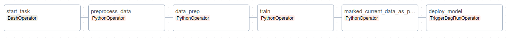
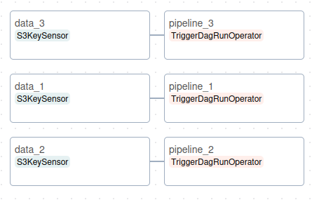

# Robustness, Resilience, Reliability and Elasticity (R3E) for ML pipelines with Apache Airflow

## Startup instructions
Prerequisites for this project are Apache Airflow, PostgreSQL, and minio. After these prerequisites are installed, just run the following command(s)
```bash
$ bash init.sh # if running the first time
$ bash start.sh
```

### Content
1. Introduction
2. Related Technology
3. Apache Airflow for R3E
4. Conclusion


## 1. Introduction
In this modern, technology-thriving world, each day we hear about new Artificial Intelligence (AI) projects and(or) products. We are currently experiencing a revolution in the technology world, where AI is becoming more popular than ever. A few types of AI exist, such as narrow AI, general AI, reactive machines, and "Theory of Mind" AI. I will not go into details with this, because it is out of the scope of this research/experiment. However, I will mention that the AI we have available as of today is narrow AI, which is trained to perform specific tasks. The best example of this is Chat-GPT. Furthermore, the key component that enables narrow AI Machine Learning (ML). ML involves algorithms that enable one system to perform a task without being programmed specifically. This kind of system is designed to make predictions, recognize patterns, and improve based on data. To have a reasonably good ML system, whose most common use case is prediction or pattern recognition, a big dataset is required to train an ML model, which is the final structure where the result from an ML system is stored. The ML model is used to make the prediction or recognize the pattern, and the bigger the dataset the more accurate the ML model will be. There are a few caveats with that as well, however, that is out of the scope of this research.
The process of training an ML model is usually automated using an ML pipeline, which is a collection of automated processes such as collection of data, preparation of data, training an ML model, and deploying it. Sometimes these pipelines can be used also for monitoring the performance of the ML model, and automatically train a new one when a better dataset is available. When building an ML pipeline, it is important to consider a few aspects, i.e. the pipeline needs to be robust, resilient, reliable, and elastic. For a pipeline to be robust, it needs to be able to perform when exposed to sub-ideal circumstances; for a pipeline to be resilient, it needs to be able to handle unexpected errors and recover from them; for a pipeline to be reliable it needs to be consistent and dependable; and for a pipeline to be elastic it needs to have the ability to be dynamically scaled. This research explores whether these key aspects of an ML pipeline can be achieved using Apache Airflow.


## 2. Related Technology
What is Apache Airflow? According to their [website](https://airflow.apache.org/docs/apache-airflow/stable/index.html), "Apache Airflow is an open-source platform for developing, scheduling, and monitoring batch-oriented workflows". Airflow is based on Python, and all of the pipelines in Airflow are configured as Python code, which means that any Python modules can be used in the pipeline. This makes it a good candidate for making an ML pipeline because almost all ML models that are used today are trained in Python. After all, Python offers a lot of modules that ease the training process. Airflow uses the principle "workflows as code", which means that all of the workflows are defined as code. This from the start makes it more of a tool that can be used by AI engineers or software engineers in general, rather than a tool for pipeline designers. This approach, according to Airflow's website, "serves several purposes":

- Dynamic: All pipelines as mentioned are configured as Python code, which according to them allows dynamic pipeline generation, but I disagree. At least in the context of this research
- Extensible: "The Airflow™ framework contains operators to connect with numerous technologies. All Airflow components are extensible to easily adjust to your environment.". I partially agree with this, since Airflow indeed offers operators, but the interoperability between them is quite harder than it should be and it is more of hacking stuff other than real interoperability. Again, this is in the context of this research
- Flexible: "Workflow parameterization is built-in leveraging the [Jinja](https://jinja.palletsprojects.com/) templating engine.". Jinja's templated engine is something that I didn't experiment with. 

### Apache Airflow architecture
A workflow in Airflow is represented as a DAG(Directed Acycling Graph) which is comprised of tasks. These tasks are "arranged with dependencies and data flows taken into account". Below is a small diagram from an example DAG taken from Airflow's website:

#### **Figure 1.** Example DAG diagram
 

The DAG describes the order in which tasks are executed, also known as tasks flow, the run retries, and the dependencies between the tasks within the DAG. The tasks on the other hand describe the actual operation, i.e. code execution. Each task can be an instance of a certain operator. Operator in Airflow defines what kind of script or code is being executed. For example, there is BashOperator which executes bash scripts, and PythonOperator which executes Python code. Tasks' capabilities can be further extended with so-called providers. The providers are Python packages that extend the core of Apache Airflow, thus extending the tasks' capabilities.

Airflow as a whole, consists of multiple components:
- **Scheduler** - handles the workflows scheduling and triggering, and submitting the tasks to the executor. Multiple types of schedulers differ for example whether the task execution is sequential or there can be parallel task execution 
- **Executor** - runs tasks. In a default configuration, all of the tasks are run "inside" the scheduler, but in a real production environment, the executor pushes task execution to external workers
- **Webserver** - Airflow's UI used to inspect, trigger, and debug DAGs and tasks
- **Folder of DAG files**
- **Metadata Database** - used for storing states by the scheduler, executor, and the web server

#### **Figure 2.** Airflow Infrastructure


When running airflow, there is an automatically generated `airflow.cfg` file, which is the configuration file for Airflow and all of its components. For further reference on how Airflow is installed, how a database is initialized, and how the components are run, please see `start.sh` located in the root folder of this project.

Below is an example of DAG which has two tasks and two operators. 
```python
# Imports
from airflow import DAG
from datetime import datetime, timedelta
from airflow.operators.bash import BashOperator # Bash operator
from airflow.operators.python import PythonOperator # Python operator

# Default DAG arguments
default_args = {
    'owner': 'riste',
    'retries': 0,
    'start_date': datetime(2022, 1, 1),
    'retry_delay': timedelta(minutes=5)
}

# Python function
def print_message(**kwargs):
    print("Greetings!")

# Airflow DAG
with DAG(
    default_args=default_args,
    dag_id='example_dag',
    description='Example DAG helping familiarize with Airflow terms',
    schedule_interval='@daily'
) as dag:
    # Task 1
    python_task = PythonOperator(
        task_id='greet',
        python_callable=greet,
    )
    # Task 2
    bash_task = BashOperator(
        task_id='introduce',
        bash_command="echo My name is Riste! What is your name?"
    )

    # Task flow
    python_task.set_downstream(bash_task) # or python_task >> bash_task
```

<!-- Talk About Minio  -->
### MinIO
According to the MinIO's documentation, MinIO "is a high-performance, S3 compatible object store. It is built for large-scale AI/ML, data lake, and database workloads. It is software-defined and runs on any cloud or on-premises infrastructure. MinIO is dual-licensed under the open source GNU AGPL v3 and a commercial enterprise license". I am not sure if there is something else that can be added to this other than [this documentation](https://min.io/docs/minio/linux/index.html) was followed.

## 3. Apache Airflow for R3E
Now when the reader is familiar with the general Airflow structure and the basic terms in ML, it is time to connect R3E with Airflow. As mentioned in the introduction, the main motivation for this paper is to explore whether airflow is a suitable tool for achieving the R3E for an ML pipeline. So first let's start with the pipeline. The pipeline used in this research is [_kohei-mu's_](https://www.kaggle.com/koheimuramatsu) project, [IoT Temperature Forecasting](https://www.kaggle.com/code/koheimuramatsu/iot-temperature-forecasting), which is transformed into full-blown ML pipeline per Airflow's specification, which means that the code from the Jupyter notebook is converted into tasks. In the figure below, can be seen the structure of the ML pipeline in Airflow:

#### **Figure 3.** Transfered project as pipeline in airflow


Now, this is just a project transfer and it is not a complete ML pipeline from beginning to end. Transforming this into a real ML pipeline and difficult and time-consuming task. First, to make this a full ML pipeline, some data fetching mechanism is needed. That somewhere in this case is going to be Minio S3 instance. To make S3 work with Airflow, the core of Airflow needs to be extended using the [AWS provider](https://airflow.apache.org/docs/apache-airflow-providers-amazon/stable/index.html). Airflow has a built-in mechanism for creating connections, so specifying the connection was a breeze. After installing the provider, there are two ways for the data fetching logic. The approach I took is to write a task, which is going to get the data from a S3 bucket and then process it as needed. The other possible approach is to basically write the same logic as a custom backend, and then utilize that. Now, the first issue is that when you try to download an object from S3, there is some default directory to which the airflow downloads it. That is fine, but when you specify a path in which you want to download the object, airflow still appends a temporary directory to the path. This is a random temporary directory, and there is no direct way to exclude it from the path. The only viable solution that I found was to match that directory with a wildcard, get the object from the directory, transfer it to the desired location, rename it as required, and clean up the temporary directory. This was not going to be that much of an issue if Airflow could pass data between tasks, which is the next issue.

Apache Airflow has a very weird quirk, **no** direct way exists for passing data from one task to another. So it is better to illustrate it with practical an example. The figure below is a complete pipeline that fetches data from S3, preprocesses it, prepares it for training, trains an ML model, saves the ML model as .pkl, and triggers another DAG for deploying the model.

#### **Figure 4.** ML pipeline in airflow


Each of these tasks naturally produces an output. Because of the inability to pass data directly from one task to another, the result from each task needs to be stored in S3. So, essentially each of the tasks makes two S3 requests, one for getting the result from the previous task from S3 and the other for uploading the current result to S3. That increases the workload on both the S3 instance and the machine that is running Airflow. From one viewpoint, this reduces the reliability because if a single upload fails, despite the task resulting in success, the pipeline will fail. On the other hand, it increases the robustness, because although there is too much unnecessary data passing, when a task fails, the task can retry and continue where it left off. Furthermore, robustness is increased with the automatic task retries, which allows the task to be retired **x** amount of time with a delay of **y** seconds. From this, I can say that robustness is a strong side of Apache airflow and it is definitely easily achievable. 

Now, let's focus on the **resilience**. The resilience is harder to achieve in Airflow than it needs to be because all of the error handling needs to be done manually inside the DAG. Now this would be more of a management question, who should write the DAGs for airflow, a software/system engineer or a DevOps engineer? So far it looks like Airflow is designed for software/system engineers who know DevOps, not for DevOps engineers.

The next aspect is the **reliability**. In my opinion, as I mentioned before because the unnecessary passing of the data, is slightly decreased, unit tests can be always used to make sure that the code is running properly. How and whether that should be done using Airflow or pure Python, won't be discussed since that is out of the scope of this research and it wasn't explored at all.

The last aspect of R3E is the **elasticity** aspect. I am not sure how much here can be said except that practically elasticity is non-existent. There is no automatic scaling nor constant event listeners simply because Airflow is not an event-driven tool. If you want to have those capabilities, which we certainly do when talking about ML pipelines and especially when big data is in question, this is not the right tool for the job. At this point, the question of whether Airflow is a suitable tool to use for R3E for ML pipelines or Big Data ML pipelines in general arises. Let's take a look at the performance as well and then we can conclude.

To begin with, BigData ML systems in general require a lot of resources to handle the data. Now, let's say we have a pipeline where we have three files and when those files are changed, the model needs to be retrained. This is an impossible task to do in one pipeline. So, the proper way is to have a pipeline like on Figure 5. which determines which pipeline will be run depending on which data changed:

#### **Figure 5.** Data listeners


As it can be seen, this DAG triggers the appropriate dag on file change. Now the issue arises again from Airflow's inability to share data between tasks and the fact that it loads the data in memory. If we take that the size of one file is 1TB, it would require 1TB of RAM just so the data could be loaded. There is no built-in mechanism for gradually loading or processing data, which means that handling Big Data using Airflow is costly. I am not saying that there are tools that have integrated gradual data processing, but Airflow does not and it is just not the right tool for this kind of use cases. I believe by now there are enough illustrated examples and a conclusion can be made.


## 4. Conclusion
To sum up this research, it explores whether Apache Airflow is the proper tool to achieve R3E for ML pipelines and whether Apache Airflow is a tool that can even be used for Big Data ML pipelines. The short answer to this is no, Apache Airflow is not the right tool for this, but that is just fine because, in the end, Airflow is not even designed to be used for this. It just happens that the Pipelines or so-called DAGs are defined in Python and Python is the most popular language used for ML. Despite this, Airflow is a great tool that offers robust developing, scheduling, and monitoring batch-oriented workflows, like it is stated in their documentation. Just out of curiosity, I asked Chat-GPT the following question: "__I want to build a resilient, robust, and elastic ML pipeline. Now the question is, is Apache Airflow the proper tool for this, and if no, what are the most appropriate tools that are specifically used for this ?__", and after some short conversation, the final answer was this

> Chat-GPT 3.5 Response:
>
> Certainly! For beginners looking for an easy-to-use tool for building machine learning pipelines, Prefect is a good choice. It is designed with simplicity in mind, has a Python-native syntax, and offers a straightforward approach to building and orchestrating workflows. Prefect also has good documentation and is gaining traction in the data engineering and machine learning communities.

## Sources that helped this research
- [R3E -An Approach to Robustness, Reliability, Resilience and Elasticity Engineering for End-to-End Machine Learning Systems](https://www.researchgate.net/publication/341762862_R3E_-An_Approach_to_Robustness_Reliability_Resilience_and_Elasticity_Engineering_for_End-to-End_Machine_Learning_Systems)
- [Aalto CS-E4660 - Advanced Topics in Software Systems](https://github.com/rdsea/sys4bigml)
- [Benchmarking big data systems: A survey](https://www.sciencedirect.com/science/article/abs/pii/S0140366419312344)